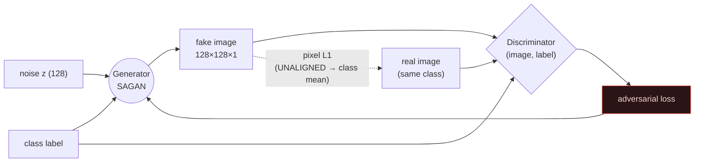
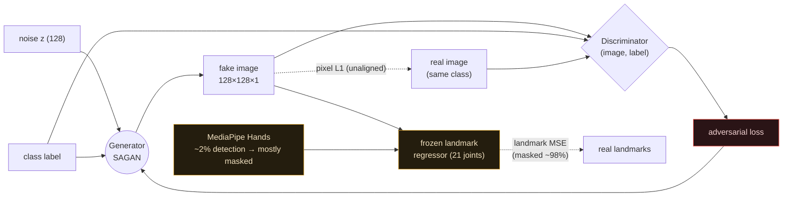
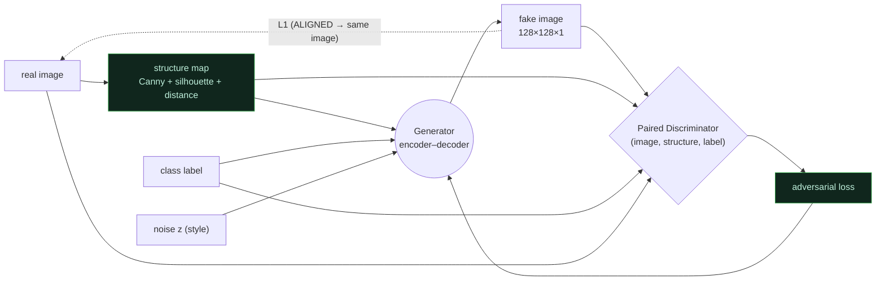
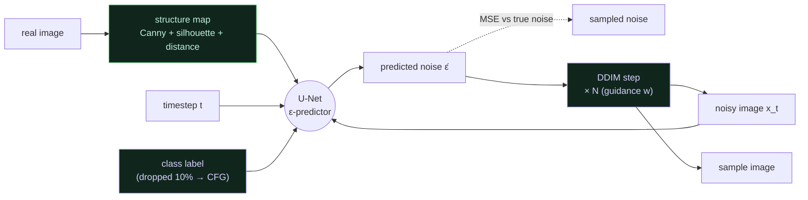

# Arabic Sign Language Image Generation (ArASL 54K)

Two conditional GANs that generate 128×128 grayscale Arabic Sign Language hand images
(32 letter classes) from the **ArASL 54K** dataset.

## Models

This repo evaluates **four** generators on ArASL. A/B/C share one cGAN backbone and
differ in *how* they get structural supervision; **D switches paradigm** to a
structure-conditioned diffusion model. Conditioning/supervision is the axis that
decides everything.

| Model | Notebook | How it's conditioned | Structural supervision | Extra dependency |
|-------|----------|----------------------|------------------------|------------------|
| **A** | [`notebooks/model_A_cgan_128_no_mediapipe.ipynb`](notebooks/model_A_cgan_128_no_mediapipe.ipynb) | Class label only | Pixel L1 to an unaligned target | — |
| **B** | [`notebooks/model_B_cgan_128_mediapipe.ipynb`](notebooks/model_B_cgan_128_mediapipe.ipynb) | Class label only | Pixel L1 **+** MediaPipe landmark MSE | MediaPipe Hands |
| **C** | [`notebooks/model_C_cgan_128_structure.ipynb`](notebooks/model_C_cgan_128_structure.ipynb) | Class label **+ per-image structure map** | Adversarial + paired (structure and target from the *same* image) | OpenCV (Canny/distance transform) |
| **D** | [`notebooks/model_D_diffusion_structure.ipynb`](notebooks/model_D_diffusion_structure.ipynb) | Structure map **+ class**, **+ classifier-free guidance** | Iterative denoising (DDPM), **not** a GAN | OpenCV |

### Shared backbone (A, B, C)

A class-conditional SAGAN: a generator with **self-attention at 32×32**, a
**spectral-normalized** discriminator using **spatial label projection**, **asymmetric
learning rates** (`LR_G = 2e-4`, `LR_D = 1e-4`), **label smoothing** (0.9), and an
**adaptive G:D update ratio** (up to 2 G-steps per D-step). Latent `Z_DIM = 128`,
128×128 grayscale, 32 letter classes. See [`src/config.py`](src/config.py) for the full
hyperparameter set and the staged pixel-loss schedule (`LAMBDA_PIX` warms 0.5 → 5.0).

### Model A — class-conditioned cGAN, pixel loss only (the baseline)

The plain baseline: the generator sees **only the class label** and noise. Structural
guidance comes entirely from a **pixel L1** term against a real image of that class.
Because the sampled fake and the real target are **not aligned**, the L1 minimizer drifts
toward the per-class *mean* image — a regress-to-mean pressure that **suppresses diversity**
(local run: diversity ≈ 0.11, GAN-test ≈ 0.45). A is the control that isolates what the
extra supervision in B and C actually buys.



### Model B — A + MediaPipe landmark loss (the "structure-as-loss" hypothesis)

Identical to A, plus a second supervision signal: a landmark regressor / MediaPipe Hands
extracts 21 hand keypoints and B adds a **landmark MSE** loss (`LAMBDA_LM` warms 0 → 2.0
after a 15-epoch delay). The bet is that scoring generated hands against landmark targets
will enforce correct finger structure **without changing the conditioning**.

It doesn't pan out here. MediaPipe is built for in-the-wild RGB hands; on tightly-cropped
**low-res grayscale alphabet** signs its **detection rate collapses** (only **2.06%** at
64px in the local run), so the landmark loss is **masked out for ~98% of samples** and adds
essentially nothing over A. Worse, the landmark target is still **unaligned** with the
sampled fake — same regress-to-mean trap as A. B is a faithful test of a plausible idea
that the data simply doesn't support.



### Model C — structure-conditioned cGAN (the one that works)

C changes the *conditioning*, not just the loss. For every image it computes a 3-channel
**structure map** — **Canny edges + silhouette + distance transform** (standalone notebook:
[`notebooks/model_C_cgan_128_structure.ipynb`](notebooks/model_C_cgan_128_structure.ipynb); see also
[`experiments/scripts/prep_data.py`](experiments/scripts/prep_data.py)) — and feeds that map
to the generator **and** to a **paired discriminator** that judges `(image, structure, label)`
triples. Crucially the structure map and the target come from the **same image**, restoring
the spatial correspondence that A and B lack, so there is no regress-to-mean pressure
(diversity jumps to ≈ 0.33).

In the local 5K run C wins decisively — **GAN-test 0.95 vs ~0.5 for A/B**, uniformly strong
across all 10 classes — and a **held-out structure test** confirms it *generalizes* rather
than memorizes: feeding C structure maps from 250 images it never trained on still yields
**0.93 recognition** (gap of just **0.024** vs training structures) and **SSIM 0.95** against
the true target. The trade is ~1.5× the training time (heavier conditioned encoder + paired
discriminator). This mirrors the broader literature — conditioning on structure (edges /
pose / skeleton) is the consensus method behind pix2pix, ControlNet, and modern sign-language
generators. See [`reports/`](reports/) for the prior-art search and verdict.



### Model D — structure-conditioned diffusion + classifier-free guidance (different paradigm)

A/B/C are GANs. **Model D is a different idea entirely:** an *iterative denoising
diffusion model*. It **keeps Model C's winning insight** (condition on a per-image
structure map, aligned target) but replaces the single-shot adversarial generator with
a **time-conditioned U-Net** trained on a simple noise-prediction MSE (DDPM). The
structure map is **concatenated to the noisy image** at the U-Net input (ControlNet-lite),
and the class enters through the timestep embedding.

The accuracy lever is **classifier-free guidance (CFG)**: during training the class label
is dropped ~10% of steps so the network learns both *conditional* and *unconditional*
scores; at sampling, a guidance scale `w` pushes generations toward the class. Turning `w`
up trades diversity for **stronger class adherence → higher recognition** — the standalone
notebook and the experiment harness both report a **CFG sweep** showing this trade-off.
Sampling uses **DDIM** (few steps) to stay tractable.

The *hypothesis* was a gain over C: diffusion models beat GANs on class-conditional fidelity,
train **stably**, and CFG is a principled accuracy dial. This is the field's consensus next step
beyond a structure-conditioned cGAN (pix2pix → ControlNet-style diffusion; SignDiff / Sign-IDD for
sign language) and the direction [`reports/conclusions.md`](reports/conclusions.md) recommends.

⚠️ **What actually happened in the reduced run:** D scored **0.82 recognition — below C's 0.95** —
and **CFG did not help** (higher `w` slightly lowered recognition; see the
[Results](#results-at-a-glance-local-5k-run) table and the
[CFG sweep](experiments/README.md)). Diffusion *did* train stably (smooth loss, no collapse), so
the likely culprit is **undertraining** (10 epochs / 30 DDIM steps is far too few for diffusion,
while the GANs converge fast at this scale) — not a refutation of the approach. A fair test needs
more epochs and sampling steps, ideally on GPU.



## Documentation

An attractive step-by-step walkthrough of how all four models work:

➡️ **Open [`docs/index.html`](docs/index.html) in a browser.**

It covers the shared backbone, each model's training steps, the loss functions,
an A-vs-B-vs-C-vs-D comparison, the evaluation suite, and honest engineering notes.
Model C and Model D also have dedicated deep-dive pages
([`docs/model-C-validation.html`](docs/model-C-validation.html),
[`docs/model-D-diffusion.html`](docs/model-D-diffusion.html)).

## Project structure

```
.
├── README.md
├── docs/             # HTML walkthroughs (models, generator, optimizations, problems, Model C, Model D)
├── notebooks/        # A, B, C, D standalone + optimized A/B + the A/B/C comparison notebook
├── src/              # optimized, modular reimplementation (config, models, data, training)
├── reports/          # literature search + Model C prior-art + verdict/opinion (HTML + md)
├── experiments/      # real local A/B/C/D runs
│   ├── scripts/          # data prep, MediaPipe landmarks, train + evaluate (incl. train_eval_D.py)
│   ├── arrays/           # prepared .npy (gitignored)
│   ├── results/          # metrics JSON + logs
│   └── visualizations/   # HTML report + image grids
└── data/             # dataset (gitignored — large): ArASL_dataset/, samples/, arasl.parquet
```

## Results at a glance (local 5K run)

Reduced CPU run — 10 classes, 4,750 train / 250 held-out, 64×64 (chance = 0.10).
A/B/C: 6 epochs, classifier-on-real = 0.956. D: 10 epochs / 30 DDIM steps,
classifier-on-real = 0.980. Treat magnitudes as **directional**.

| Model | GAN-test ↑ | GAN-train ↑ | Diversity ↑ | Train time |
|-------|:---:|:---:|:---:|:---:|
| A — no MediaPipe            | 0.447 | 0.144 | 0.105 | 432 s |
| B — MediaPipe landmark loss | 0.547 | 0.232 | 0.125 | 372 s |
| **C — structure-conditioned GAN** | **0.947** | 0.204 | **0.330** | 889 s |
| D — structure-conditioned diffusion + CFG | 0.819 | — | 0.256 | 2 199 s |

**Honest outcome:** in this reduced run **C still leads**; Model D (diffusion) landed
at **0.82**, and classifier-free guidance did **not** raise recognition (higher `w`
slightly lowered it — see the [CFG sweep](experiments/README.md)). The most likely
cause is that diffusion is **undertrained** here — 10 epochs / 30 DDIM steps is far
less than diffusion typically needs, while the GANs converge fast at this tiny scale.
D *did* train **stably** (no mode collapse, no G/D balancing). So this is a directional
run, **not** a verdict that diffusion is worse — a fair test needs more epochs / sampling
steps (ideally GPU). See [`reports/`](reports/) and [`experiments/`](experiments/) for raw runs.

## Dataset

`ArASL_Database_54K_Final` — ~54,000 grayscale hand-sign images across 32 Arabic letter classes.
Not included in this repo (see `.gitignore`); the notebooks expect it on Google Drive at
`/content/drive/MyDrive/ArASL_Database_54K_Final/`.

## Evaluation

FID, SSIM, LPIPS, intra-class diversity (all models); PKLE — landmark error (Model B only);
**GAN-test / GAN-train recognition** and a **held-out structure test** (Models C & D); and a
**classifier-free-guidance sweep** (Model D — recognition vs guidance scale `w`).

## Notes & direction

See the **Honest Engineering Notes** section in `docs/index.html`. The arc of this repo: the
proposal (`docs/assets/proposal.jpg`) pointed toward using structure as a per-image *conditioning
input* rather than a loss against unaligned targets. **Model C** realizes that as a
structure-conditioned cGAN (and wins the local run); **Model D** takes the consensus next step —
a structure-conditioned **diffusion** model with classifier-free guidance — trading single-shot
speed for stabler training and a tunable accuracy dial.
