# Arabic Sign Language Image Generation (ArASL 54K)

Conditional GANs — and a diffusion baseline — that generate 128×128 grayscale Arabic
Sign Language hand images (32 letter classes) from the **ArASL 54K** dataset. The best
model, **G**, reaches **94.6% recognition** against a **97.5%** real-image ceiling.

## Models

This repo evaluates a **ladder of five conditional GANs (A → B → C → F → G)** plus a
**diffusion baseline (D)**. A/B/C share one cGAN backbone and differ in *how* they get
structural supervision; **F** and **G** extend the structure-conditioned Model C with
fusion losses (**G is the best model, 94.6%**); **D switches paradigm** to a
structure-conditioned diffusion model. Conditioning/supervision is the axis that decides
everything. The A/B/C/D notebooks are documented below; the full **A → B → C → F → G
paper track** (F/G) is in the [Paper track](#paper-track--fusion-models-f--g-128px-gpu-runs)
section, with results and loss details.

| Model | Notebook / script | How it's conditioned | Structural supervision | Extra dependency |
|-------|-------------------|----------------------|------------------------|------------------|
| **A** | [`notebooks/model_A_cgan_128_no_mediapipe.ipynb`](notebooks/model_A_cgan_128_no_mediapipe.ipynb) | Class label only | Pixel L1 to an unaligned target | — |
| **B** | [`notebooks/model_B_cgan_128_mediapipe.ipynb`](notebooks/model_B_cgan_128_mediapipe.ipynb) | Class label only | Pixel L1 **+** MediaPipe landmark MSE | MediaPipe Hands |
| **C** | [`notebooks/model_C_cgan_128_structure.ipynb`](notebooks/model_C_cgan_128_structure.ipynb) | Class label **+ per-image structure map** | Adversarial + paired (structure and target from the *same* image) | OpenCV (Canny/distance transform) |
| **F** | [`src/train_model_f.py`](src/train_model_f.py) | Class label **+ per-image structure map** | Model C **+ frozen-landmark consistency loss** (all samples) | OpenCV, Model B regressor |
| **G** | [`src/train_model_g.py`](src/train_model_g.py) | Class label **+ per-image structure map** | Model F **+ feature-matching + auxiliary-classifier recognition + EMA** (**best, 94.6%**) | OpenCV, aux classifier |
| **D** | [`notebooks/model_D_diffusion_structure.ipynb`](notebooks/model_D_diffusion_structure.ipynb) | Structure map **+ class**, **+ classifier-free guidance** | Iterative denoising (DDPM), **not** a GAN | OpenCV |

### Shared backbone (A, B, C)

A class-conditional SAGAN: a generator with **self-attention at 32×32**, a
**spectral-normalized** discriminator using **spatial label projection**, **asymmetric
learning rates** (`LR_G = 2e-4`, `LR_D = 1e-4`), **label smoothing** (0.9), and an
**adaptive G:D update ratio** (up to 2 G-steps per D-step). Latent `Z_DIM = 128`,
128×128 grayscale, 32 letter classes. See [`src/config.py`](src/config.py) for the full
hyperparameter set and the staged pixel-loss schedule (`LAMBDA_PIX` warms 0.5 → 5.0).

### Model A — class-conditioned cGAN, pixel loss only (the baseline)

The plain baseline: the generator sees **only the class label** and noise. Structural
guidance comes entirely from a **pixel L1** term against a real image of that class.
Because the sampled fake and the real target are **not aligned**, the L1 minimizer drifts
toward the per-class *mean* image — a regress-to-mean pressure that **suppresses diversity**
(local run: diversity ≈ 0.11, GAN-test ≈ 0.45). A is the control that isolates what the
extra supervision in B and C actually buys.

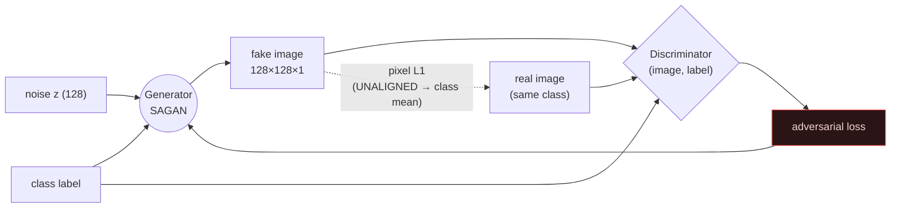

### Model B — A + MediaPipe landmark loss (the "structure-as-loss" hypothesis)

Identical to A, plus a second supervision signal: a landmark regressor / MediaPipe Hands
extracts 21 hand keypoints and B adds a **landmark MSE** loss (`LAMBDA_LM` warms 0 → 2.0
after a 15-epoch delay). The bet is that scoring generated hands against landmark targets
will enforce correct finger structure **without changing the conditioning**.

It doesn't pan out here. MediaPipe is built for in-the-wild RGB hands; on tightly-cropped
**low-res grayscale alphabet** signs its **detection rate collapses** (only **2.06%** at
64px in the local run), so the landmark loss is **masked out for ~98% of samples** and adds
essentially nothing over A. Worse, the landmark target is still **unaligned** with the
sampled fake — same regress-to-mean trap as A. B is a faithful test of a plausible idea
that the data simply doesn't support.

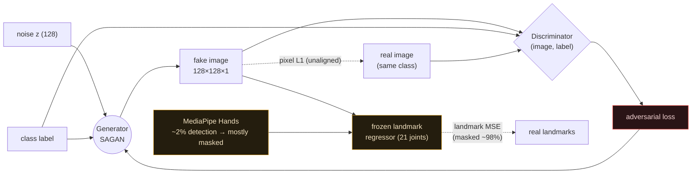

### Model C — structure-conditioned cGAN (the one that works)

C changes the *conditioning*, not just the loss. For every image it computes a 3-channel
**structure map** — **Canny edges + silhouette + distance transform** (standalone notebook:
[`notebooks/model_C_cgan_128_structure.ipynb`](notebooks/model_C_cgan_128_structure.ipynb); see also
[`experiments/scripts/prep_data.py`](experiments/scripts/prep_data.py)) — and feeds that map
to the generator **and** to a **paired discriminator** that judges `(image, structure, label)`
triples. Crucially the structure map and the target come from the **same image**, restoring
the spatial correspondence that A and B lack, so there is no regress-to-mean pressure
(diversity jumps to ≈ 0.33).

In the local 5K run C wins decisively — **GAN-test 0.95 vs ~0.5 for A/B**, uniformly strong
across all 10 classes — and a **held-out structure test** confirms it *generalizes* rather
than memorizes: feeding C structure maps from 250 images it never trained on still yields
**0.93 recognition** (gap of just **0.024** vs training structures) and **SSIM 0.95** against
the true target. The trade is ~1.5× the training time (heavier conditioned encoder + paired
discriminator). This mirrors the broader literature — conditioning on structure (edges /
pose / skeleton) is the consensus method behind pix2pix, ControlNet, and modern sign-language
generators. See [`reports/`](reports/) for the prior-art search and verdict.

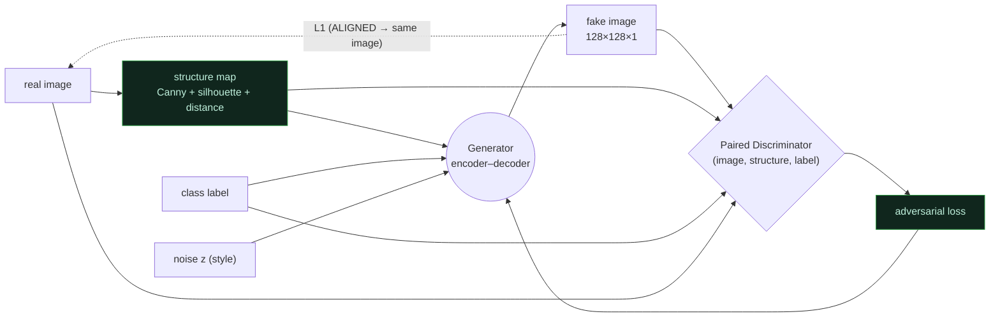

### Model D — structure-conditioned diffusion + classifier-free guidance (different paradigm)

A/B/C are GANs. **Model D is a different idea entirely:** an *iterative denoising
diffusion model*. It **keeps Model C's winning insight** (condition on a per-image
structure map, aligned target) but replaces the single-shot adversarial generator with
a **time-conditioned U-Net** trained on a simple noise-prediction MSE (DDPM). The
structure map is **concatenated to the noisy image** at the U-Net input (ControlNet-lite),
and the class enters through the timestep embedding.

The accuracy lever is **classifier-free guidance (CFG)**: during training the class label
is dropped ~10% of steps so the network learns both *conditional* and *unconditional*
scores; at sampling, a guidance scale `w` pushes generations toward the class. Turning `w`
up trades diversity for **stronger class adherence → higher recognition** — the standalone
notebook and the experiment harness both report a **CFG sweep** showing this trade-off.
Sampling uses **DDIM** (few steps) to stay tractable.

The *hypothesis* was a gain over C: diffusion models beat GANs on class-conditional fidelity,
train **stably**, and CFG is a principled accuracy dial. This is the field's consensus next step
beyond a structure-conditioned cGAN (pix2pix → ControlNet-style diffusion; SignDiff / Sign-IDD for
sign language) and the direction [`reports/conclusions.md`](reports/conclusions.md) recommends.

⚠️ **What actually happened in the reduced run:** D scored **0.82 recognition — below C's 0.95** —
and **CFG did not help** (higher `w` slightly lowered recognition; see the
[Results](#results-at-a-glance-local-5k-run) table and the
[CFG sweep](experiments/README.md)). Diffusion *did* train stably (smooth loss, no collapse), so
the likely culprit is **undertraining** (10 epochs / 30 DDIM steps is far too few for diffusion,
while the GANs converge fast at this scale) — not a refutation of the approach. A fair test needs
more epochs and sampling steps, ideally on GPU.

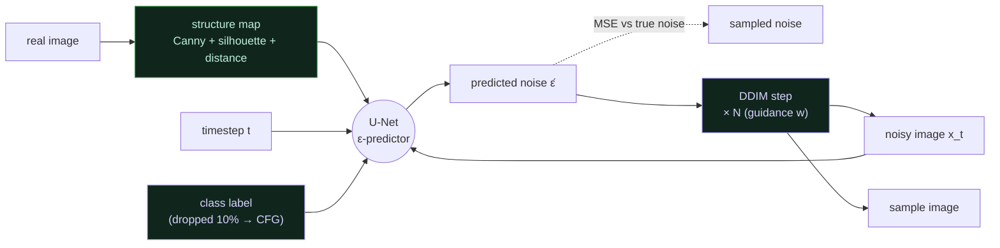

#### Model D — block diagram (U-Net architecture + train/sample paths)

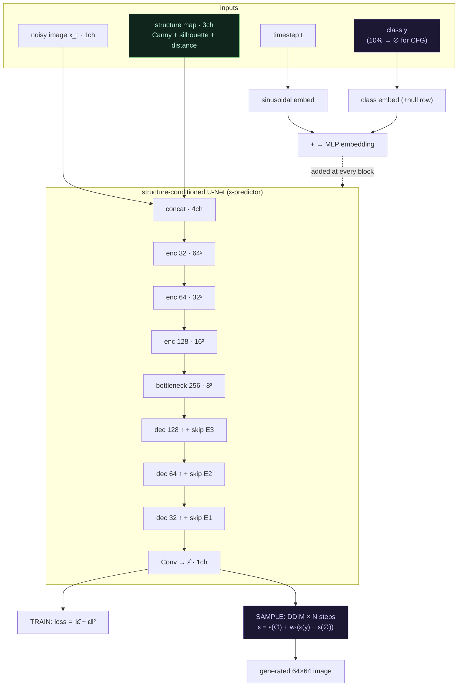

> Channels shown match the reduced 64px harness (`experiments/scripts/train_eval_D.py`);
> the 128px notebook adds one more encoder/decoder level. The timestep+class embedding is
> injected at **every** conv block; the structure map is concatenated only at the input
> (ControlNet-lite). Classifier-free guidance acts at **sampling** time via the scale `w`.

## Documentation

An attractive step-by-step walkthrough of how all four models work:

➡️ **Open [`docs/index.html`](docs/index.html) in a browser.**

It covers the shared backbone, each model's training steps, the loss functions,
an A-vs-B-vs-C-vs-D comparison, the evaluation suite, and honest engineering notes.
Model C and Model D also have dedicated deep-dive pages
([`docs/model-C-validation.html`](docs/model-C-validation.html),
[`docs/model-D-diffusion.html`](docs/model-D-diffusion.html)).

## Paper track — fusion models F & G (128px GPU runs)

Beyond the notebook track (A/B/C/D), the `src/` + `reports/paper/` **paper track**
carries the fusion line **A → B → C → F → G**, trained full-resolution on the RTX 3050.
**F** = Model C + a frozen-landmark consistency loss (recognition **76.1% → 87.2%**).
**G** = F + an auxiliary-classifier recognition loss, pix2pixHD feature-matching, an
L1-upgraded landmark term, and generator weight EMA — engineered to fit 8 GB. **G is
the best model at 94.6% recognition**, closing ~72% of F's remaining gap to the
**97.5%** real-image ceiling while *increasing* diversity.

### Results summary (128px, all five models — one comparable run)

GAN-test recognition = a classifier trained on **real** images, tested on generated
samples. Reference classifier on real held-out = **0.9752** (the ceiling).

| Model | Conditioning / added signal | Recognition ↑ | Diversity ↑ | SSIM ↑ | Held-out | Gap |
|-------|-----------------------------|:---:|:---:|:---:|:---:|:---:|
| A | label only, pixel L1 | 0.6367 | 0.178 | — | — | — |
| B | + MediaPipe landmark loss | 0.6625 | 0.193 | — | — | — |
| C | structure-conditioned cGAN | 0.7609 | 0.414 | 0.752 | 0.742 | 0.019 |
| F | C + landmark fusion | 0.8719 | 0.372 | 0.825 | 0.854 | 0.018 |
| **G** | **F + recognition + feature-match + EMA** | **0.9461** | **0.401** | 0.825 | 0.906 | 0.040 |

**Takeaways.** (1) Conditioning is the axis that matters: the label-only models (A/B)
stall near 0.64–0.66; switching to structure conditioning with an aligned target (C)
jumps to 0.76. (2) The landmark-fusion term (F) is the biggest single gain (+0.11).
(3) **Model G is the best model — 0.946 recognition (+0.074 over F)**, closing ~72% of
F's remaining gap to the real-image ceiling *and increasing* diversity (no AC-GAN
collapse). Its residual ~3-point gap to real is texture fidelity (SSIM flat at 0.825)
plus intrinsic letter ambiguity — G has no weak class left (worst = `aleff` at 0.83),
with errors diffuse and a small persistent `→ kaaf` confusion cluster.
Full metrics: [`reports/paper/results/metrics.json`](reports/paper/results/metrics.json);
per-class heatmaps: [`reports/paper/results/`](reports/paper/results/).

**Qualitative samples** (real vs each model, per letter — regenerate with
`python src/make_generation_figures.py`):

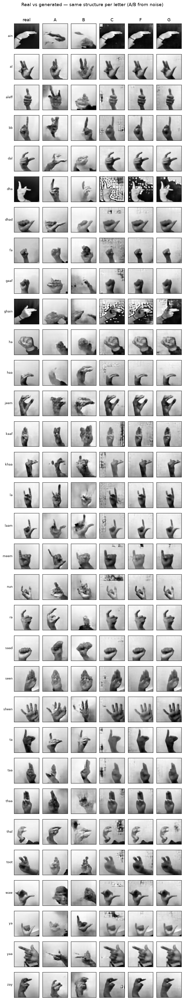

Per-model 8×32 generation grids: [`reports/paper/figures/`](reports/paper/figures/)
(`samples_A.png` … `samples_G.png`).

### Per-class confusion — all models

Row-normalized confusion matrices (true intended letter vs the reference classifier's
prediction over generated samples). A brighter, cleaner diagonal = better per-class
recognition. Numbers below are from the confusion run (independent classifier, 60
samples/class), so they track — but don't exactly equal — the headline recognition.

| Model A | Model B | Model C |
|:---:|:---:|:---:|
| 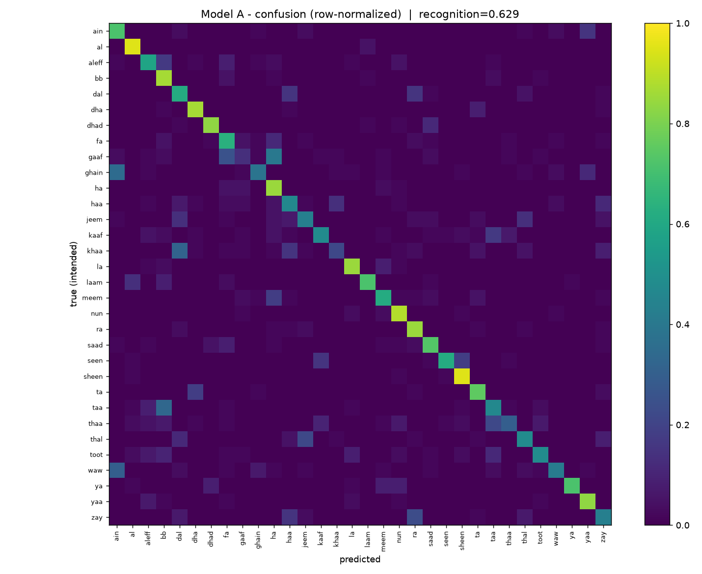 | 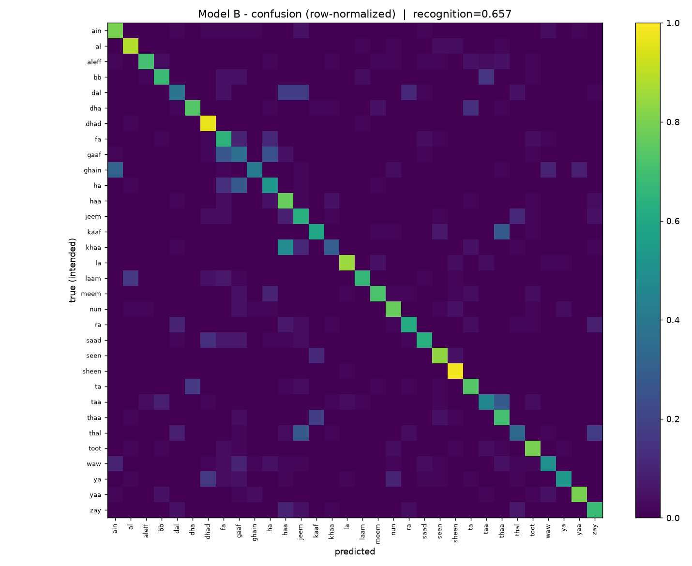 | 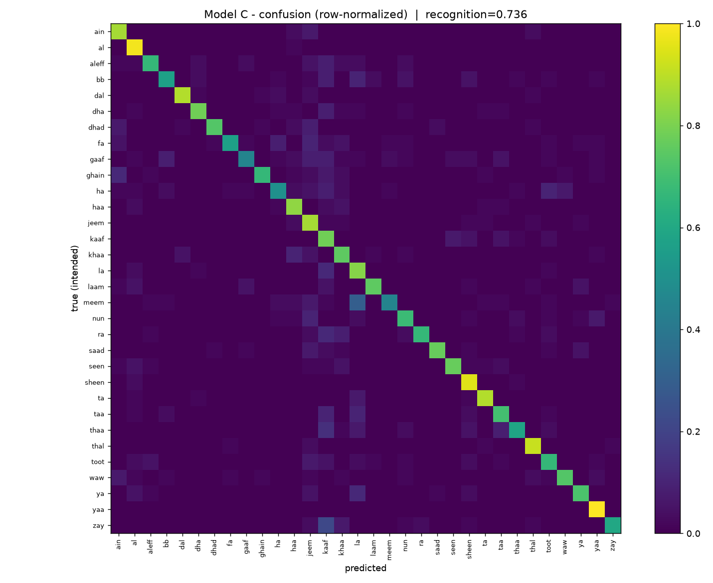 |

| Model F | **Model G (best)** |
|:---:|:---:|
| 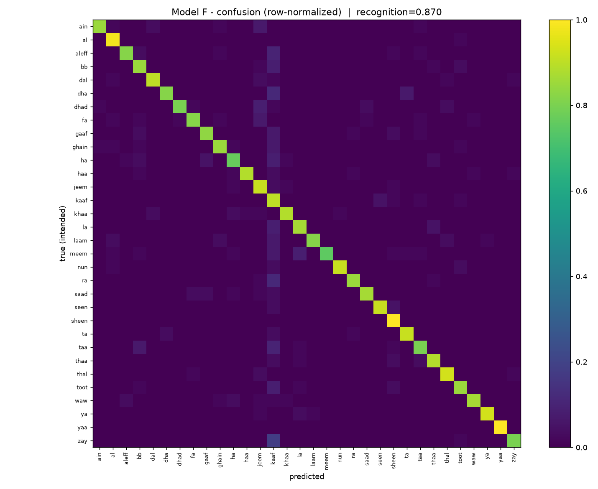 | 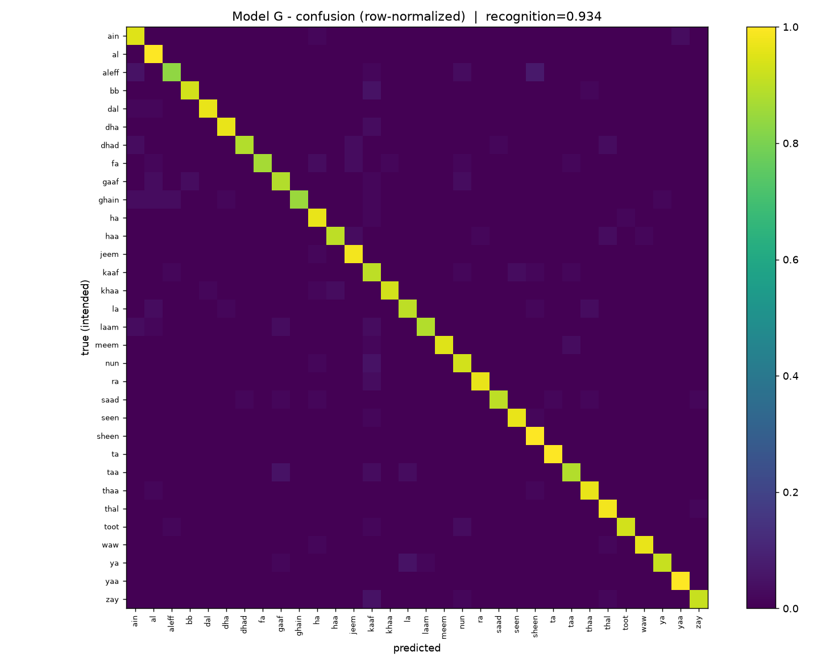 |

**Weakest classes per model** — the per-class *floor* rises steadily A → G:

| Rank | A | B | C | F | **G (best)** |
|:---:|---|---|---|---|---|
| 1 (worst) | gaaf 0.13 | gaaf 0.25 | gaaf 0.45 | meem 0.75 | **aleff 0.83** |
| 2 | khaa 0.22 | khaa 0.33 | meem 0.45 | ha 0.77 | ghain 0.85 |
| 3 | thaa 0.30 | ghain 0.42 | ha 0.50 | dhad 0.80 | fa 0.87 |
| 4 | ghain 0.38 | dal 0.45 | bb 0.57 | taa 0.80 | dhad 0.88 |
| 5 | waw 0.42 | thal 0.47 | fa 0.57 | zay 0.80 | gaaf 0.88 |
| 6 | jeem 0.43 | waw 0.53 | thaa 0.58 | aleff 0.82 | laam 0.88 |

Model A's *worst* class is recognized only 13% of the time; by Model G **every one of
the 32 classes clears 83%.**

**Most-confused letter pairs** (intended → predicted, fraction of samples):

| Model | Top confusions |
|-------|----------------|
| A | `gaaf→ha` .40 · `ghain→ain` .35 · `taa→bb` .33 |
| B | `gaaf→fa` .33 · `gaaf→ha` .33 · `ghain→ain` .30 |
| C | `meem→la` .30 · `zay→kaaf` .22 · `thaa→kaaf` .13 |
| F | `zay→kaaf` .18 · `dha→kaaf` .12 · `ra→kaaf` .12 |
| **G** | `aleff→sheen` .07 · `aleff→ain` .05 · `bb→kaaf` .05 |

A persistent **`→ kaaf` attractor** appears from Model C onward (open-hand shapes drift
toward `kaaf`); Model G shrinks *every* confusion below 0.07. Full per-class data:
[`reports/paper/results/confusion_summary.json`](reports/paper/results/confusion_summary.json).

- 📄 **[`reports/paper/model_G.md`](reports/paper/model_G.md)** — Model G deep-dive (design rationale, loss, memory)
- 📇 **[`reports/paper/model_cards.md`](reports/paper/model_cards.md)** — per-model cards + results table
- 📝 **[`reports/paper/paper.md`](reports/paper/paper.md)** — paper-ready scaffold
- 🖼️ **[`reports/paper/models_explainer.html`](reports/paper/models_explainer.html)** — visual block-diagram walkthrough with real dataset images
- 🎛️ **[`reports/paper/interface/app.py`](reports/paper/interface/app.py)** — Gradio demo: pick a letter + model, generate signs from **any of the 5 models** (`pip install gradio && python reports/paper/interface/app.py`)

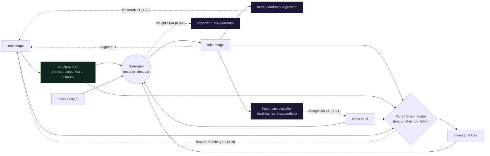

### How Model G works — step by step

Model G is a **structure-conditioned image translator wrapped in four teachers.**
One training iteration does the following:

1. **Condition.** For a real training image, a 3-channel **structure map** (Canny
   edges + Otsu silhouette + distance transform) is computed. This is the *shape*
   the generator must render — with texture deliberately thrown away.
2. **Generate.** The generator takes `(structure map, class label, noise z)` and
   produces a fake 128×128 hand. Noise controls style/variation; the structure
   fixes the pose; the label fixes the letter.
3. **Judge (adversarial).** A **paired discriminator** scores the triple
   `(image, structure, label)` — the fake must look real *and* be consistent with
   its own structure and letter, not just look like some hand.
4. **Supervise with four teachers.** Because the structure and the target come from
   the **same** image, the generator has an *aligned* ground-truth to match. Four
   signals pull the fake toward it (details below): pixel L1, landmark L1,
   discriminator feature-matching, and an auxiliary-classifier recognition loss.
5. **Average (EMA).** After each step, an exponential moving average (decay 0.999)
   of the generator weights is updated. The **EMA copy** — smoother and higher
   quality — is what gets exported for inference.

**The 8 GB trick:** the real-side targets (discriminator features and landmarks of
the *real* image) are constants, so they are computed **outside** the gradient tape
and `stop_gradient`-ed. Only the *fake* forward passes are retained — that is what
lets three teacher networks + EMA fit on an 8 GB RTX 3050 at batch 32.

### Loss functions — how Model G improves on Model F

Model F and Model G share the **same generator and discriminator**; only the
generator's loss differs. F reached 87.2% recognition; G reaches **94.6%** — the
entire gain comes from the loss terms below.

```
L_G(F) = adv + 5·|fake−real|₁ + λ_lm·‖R(fake)−R(real)‖²                    (λ_lm→2)

L_G(G) = adv + 5·|fake−real|₁ + λ_lm·|R(fake)−R(real)|₁                    (λ_lm→8)
                              + 10·Σⱼ|Dⱼ(fake)−Dⱼ(real)|₁                  (feature match)
                              + λ_cls·CE(clf(fake), y)                      (λ_cls→1)
```

| Loss term | Model F | Model G | Why G's version is better |
|-----------|---------|---------|---------------------------|
| Adversarial | ✓ | ✓ | unchanged |
| Aligned pixel L1 | `5·L1` | `5·L1` | unchanged (structure fidelity) |
| **Landmark consistency** | MSE, `λ→2`, warmup @15 | **L1, `λ→8`, warmup @5** | MSE gradient *vanishes* as the term saturates (it was ~0.1% of F's loss); L1 keeps a persistent gradient, the larger weight and earlier warmup drive it harder |
| **Discriminator feature-matching** | — | **`10·L1` on Dⱼ activations** | pixel-L1 alone leaves texture blurry; matching the discriminator's mid-level features sharpens it — the fix for the appearance/domain gap |
| **Recognition (auxiliary classifier)** | — | **`λ→1 · CE(clf(fake),y)`** | F never optimizes *class discriminability* directly; a frozen, independently-trained classifier pushes each fake to read as its intended letter (AC-GAN) |
| **Generator export** | raw final weights | **EMA (0.999)** | averaged weights give a smoother, higher-quality generator for free |

**How to read the improvements.** F's residual gap was two things — *blurry texture*
and *class confusion on a few letters*. G adds exactly one signal per failure mode
(feature-matching for texture, recognition CE for class confusion) and **amplifies
the one term that already worked** (landmark, MSE→L1 with 4× weight). Diversity did
**not** collapse (0.372 → 0.401) because feature-matching and the aligned structure
counterbalance the mode-seeking pressure of the recognition loss.

**Model F — generator loss (3 terms):**

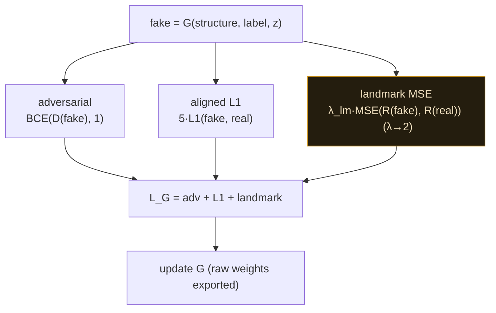

**Model G — generator loss (5 terms + EMA); new signals in violet:**

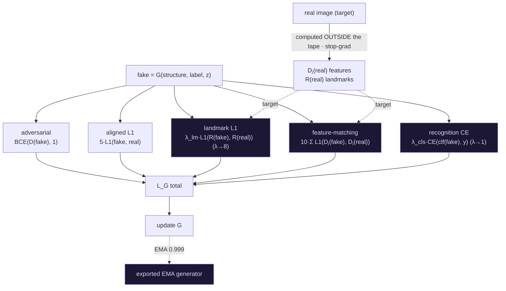

## Project structure

```
.
├── README.md
├── docs/             # HTML walkthroughs (models, generator, optimizations, problems, Model C, Model D)
├── notebooks/        # A, B, C, D standalone + optimized A/B + the A/B/C comparison notebook
├── src/              # optimized, modular reimplementation (config, models, data, training)
├── reports/          # literature search + Model C prior-art + verdict/opinion (HTML + md)
├── experiments/      # real local A/B/C/D runs
│   ├── scripts/          # data prep, MediaPipe landmarks, train + evaluate (incl. train_eval_D.py)
│   ├── arrays/           # prepared .npy (gitignored)
│   ├── results/          # metrics JSON + logs
│   └── visualizations/   # HTML report + image grids
└── data/             # dataset (gitignored — large): ArASL_dataset/, samples/, arasl.parquet
```

## Results at a glance (local 5K run)

Reduced CPU run — 10 classes, 4,750 train / 250 held-out, 64×64 (chance = 0.10).
A/B/C: 6 epochs, classifier-on-real = 0.956. D: 10 epochs / 30 DDIM steps,
classifier-on-real = 0.980. Treat magnitudes as **directional**.

| Model | GAN-test ↑ | GAN-train ↑ | Diversity ↑ | Train time |
|-------|:---:|:---:|:---:|:---:|
| A — no MediaPipe            | 0.447 | 0.144 | 0.105 | 432 s |
| B — MediaPipe landmark loss | 0.547 | 0.232 | 0.125 | 372 s |
| **C — structure-conditioned GAN** | **0.947** | 0.204 | **0.330** | 889 s |
| D — structure-conditioned diffusion + CFG | 0.819 | — | 0.256 | 2 199 s |

**Honest outcome:** in this reduced run **C still leads**; Model D (diffusion) landed
at **0.82**, and classifier-free guidance did **not** raise recognition (higher `w`
slightly lowered it — see the [CFG sweep](experiments/README.md)). The most likely
cause is that diffusion is **undertrained** here — 10 epochs / 30 DDIM steps is far
less than diffusion typically needs, while the GANs converge fast at this tiny scale.
D *did* train **stably** (no mode collapse, no G/D balancing). So this is a directional
run, **not** a verdict that diffusion is worse — a fair test needs more epochs / sampling
steps (ideally GPU). See [`reports/`](reports/) and [`experiments/`](experiments/) for raw runs.

## Dataset

`ArASL_Database_54K_Final` — ~54,000 grayscale hand-sign images across 32 Arabic letter classes.
Not included in this repo (see `.gitignore`). Every notebook now **auto-downloads it from
[`pain/ArASL_Database_Grayscale`](https://huggingface.co/datasets/pain/ArASL_Database_Grayscale)
on Hugging Face** straight to local Colab disk (`/content/ArASL_Database_54K_Final`, ~30 MB,
no account/token needed) — no manual Google Drive upload required. Google Drive is still
mounted and used for `checkpoints/`, `samples/`, `eval/`, `history/`, and `plots/`, so training
progress survives a Colab disconnect/reconnect.

## Evaluation

FID, SSIM, LPIPS, intra-class diversity (all models); PKLE — landmark error (Model B only);
**GAN-test / GAN-train recognition** and a **held-out structure test** (Models C & D); and a
**classifier-free-guidance sweep** (Model D — recognition vs guidance scale `w`).

## Notes & direction

See the **Honest Engineering Notes** section in `docs/index.html`. The arc of this repo: the
proposal (`docs/assets/proposal.jpg`) pointed toward using structure as a per-image *conditioning
input* rather than a loss against unaligned targets. **Model C** realizes that as a
structure-conditioned cGAN (and wins the local run); **Model D** takes the consensus next step —
a structure-conditioned **diffusion** model with classifier-free guidance — trading single-shot
speed for stabler training and a tunable accuracy dial.
