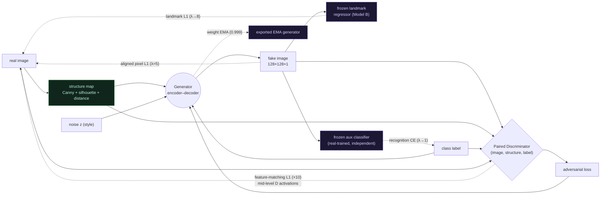

# Model G — the recognition-optimized fusion cGAN

Model G is the strongest generator in this study. It keeps everything that made
**Model F** work and adds three targeted supervision signals plus one averaging
trick, all engineered to fit an **8 GB RTX 3050**.

> **TL;DR** — F makes the hand *structurally correct*. G additionally makes it
> *look real* (feature-matching) and *classify correctly* (auxiliary-classifier
> loss), then smooths the generator with weight EMA.

---

## 1. Why F plateaued at 86%

The evaluation metric ("recognition") is the **GAN-test** of Shmelkov et al.,
*How good is my GAN?*: train a CNN classifier on **real** images, then measure its
accuracy on **generated** images. On this dataset the classifier reaches **97.5%**
on real held-out images — that is the ceiling. Model F reaches **87.2%**.

Diffing the code shows Models C and F are **byte-for-byte identical** except for
one term: F's frozen-landmark consistency loss. That single term drove the entire
**76.1% → 87.2%** jump. Yet in F's training log it is numerically tiny — about
**0.1% of the generator loss** — because it is an **MSE on a saturating signal**:
as the fake landmarks approach the real ones, the squared error (and its gradient)
vanishes.

So the residual 11-point gap is two things:

1. **Appearance / texture fidelity** — pixel-L1 alone produces slightly blurry,
   "averaged" texture that a real-trained classifier penalizes.
2. **Class confusability** — the errors concentrate on a few letters (`aleff,
   dha, zay, gaaf, laam`) whose confusions collapse *toward* `kaaf`.

Model G adds one signal for each failure mode, and amplifies the landmark term
that was being wasted.

---

## 2. What G adds (four changes vs F)

| # | Upgrade | Formula | Targets | Source |
|---|---------|---------|---------|--------|
| 1 | **Aux-classifier recognition loss** | `+ λ_cls · CE(clf(fake), y)` | class confusability | AC-GAN (Odena 2017) |
| 2 | **Discriminator feature-matching** | `+ 10 · L1(Dⱼ(fake), Dⱼ(real))` | blur / texture | pix2pixHD (Wang 2018) |
| 3 | **Landmark loss → L1, λ→8, early warmup** | `+ λ_lm · L1(R(fake), R(real))` | finger structure | strengthens F |
| 4 | **Generator weight EMA** | export `EMA₀.₉₉₉(G)` | stability / quality | Yazici 2019 |

Everything else is identical to F: the structure-conditioned encoder–decoder
generator, the paired `(image, structure, label)` discriminator, aligned pixel-L1
(λ=5), Adam, asymmetric LR, label smoothing, 50 epochs, batch 32, mixed precision.

### Design choices that keep the study honest

- **The aux classifier is independent of the evaluator.** It is trained inside
  `train_model_g.py` on real images with a **different seed** and light
  augmentation; `paper_eval.py` trains its **own** classifier for scoring. If the
  same classifier were used for both, G would be "training on the test."
- **Light augmentation** (small translation + Gaussian noise) makes the aux
  classifier robust to benign GAN texture, so its gradient guides *class shape*,
  not texture memorization.
- **Warmup.** The recognition and landmark weights ramp `0 → full` between epochs
  5 and 15, letting adversarial + L1 establish coarse structure first.

---

## 3. Full training graph



Generator loss:

```
L_G = adv
    + 5.0 · |fake − real|₁                     (aligned pixel L1)
    + λ_lm(t) · |R(fake) − R(real)|₁           (landmark, λ_lm → 8)
    + 10.0 · Σⱼ |Dⱼ(fake) − Dⱼ(real)|₁         (feature matching, j = 16², 8²)
    + λ_cls(t) · CE(clf(fake), y)              (recognition, λ_cls → 1)
```

---

## 4. Memory: fitting three teachers in 8 GB

Naively, the generator step would forward the generator, the discriminator (fake
**and** real), the landmark regressor (fake **and** real), and the classifier —
retaining activations for all of them. That overflows 8 GB.

The fix: the **real-side targets are constants** (no gradient flows to them), so
`train_model_g.py` computes `D(real)` features and `R(real)` landmarks **outside**
the `GradientTape`, casts them to float32, and `stop_gradient`s them. Only the
**fake** forward passes are taped. Batch stays 32; peak memory stays under 8 GB.
(This was validated by a GPU smoke run, which also surfaced a real mixed-precision
dtype bug the CPU test missed — float16 D-features vs float32.)

---

## 5. How to run

```bash
# train (WSL2 + RTX 3050, mixed precision) — ~4.3 h for 50 epochs
source activate_gpu_env.sh
python src/train_model_g.py

# evaluate all models incl. G (GAN-test recognition, diversity, SSIM, held-out)
python src/paper_eval.py

# per-class confusion heatmaps + most-confused pairs
python src/confusion_matrix.py
```

Outputs land in `outputs/cgan_G_128plus/` (checkpoints, EMA export, aux
classifier) and metrics in `reports/paper/results/`.

---

## 6. Outcome (measured)

Model G reaches **94.6% recognition — the best model in the study**, measured by
`paper_eval.py` on an *independent* classifier (all five models scored in one run
against the same real-trained classifier, ceiling 97.5%).

| | F | **G** | Δ |
|---|---:|---:|---:|
| Recognition | 0.8719 | **0.9461** | **+0.074** |
| Held-out recognition | 0.8540 | **0.9062** | +0.052 |
| Diversity | 0.3722 | **0.4010** | +0.029 |
| SSIM | 0.8249 | 0.8251 | ≈0 |
| Generalization gap | 0.0179 | 0.0399 | +0.022 |

G closes **~72%** of F's remaining gap to the real-image ceiling (F was 10.3
points below real; G is only 2.9 below) and — importantly — does so **without a
diversity collapse** (diversity actually rose), confirming the feature-matching +
aligned-structure signals offset the mode-seeking pressure of the
auxiliary-classifier loss. The one trade-off is a larger generalization gap
(0.040 vs 0.018): G leans slightly more on training-set structures, though it
still reaches 0.906 recognition on unseen held-out structures. During training the
auxiliary-classifier loss collapsed toward ~0.001, which correctly predicted the
strong measured result.
