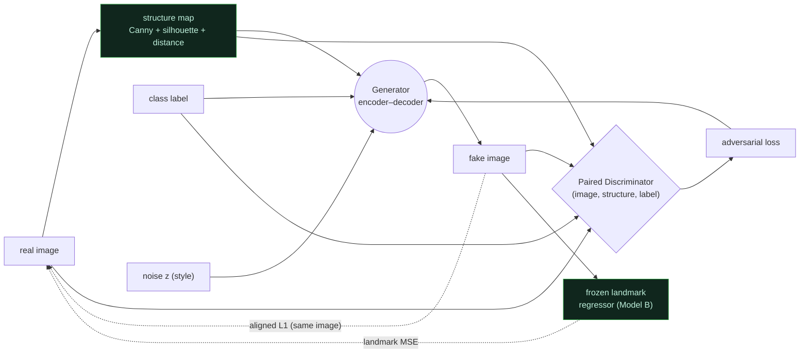
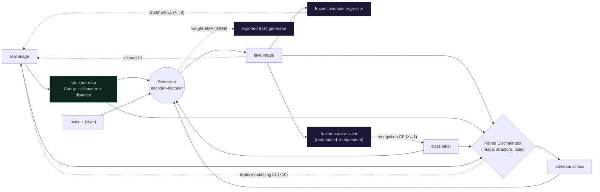

# Model Cards — ArASL Sign-Language Generation

Dataset: **ArASL 54K** (`pain/ArASL_Database_Grayscale`, 54,049 grayscale hand
images, 32 Arabic-letter classes). Full runs: **128×128**, mixed precision
(float16 compute + loss scaling), RTX 3050 (WSL2), TensorFlow 2.21.

Shared training schedule (`src/config.py`): Adam (β1=0.5, clipnorm=1.0),
`LR_G=2e-4`, `LR_D=1e-4` (asymmetric), label smoothing 0.9, 50 epochs, batch 32,
LR halved at epoch 20 (D) / 35 (G). Latent `Z_DIM=128`.

---

## Model A — class-conditioned cGAN, pixel loss only (baseline)

- **Conditioning:** class label + noise only.
- **Generator:** dense → 4×4×512 → 5× Conv2DTranspose (256→128→128→64→32) with
  SAGAN **self-attention at the 3rd upsample block**, BatchNorm+ReLU, tanh
  (float32) output. ~128px.
- **Discriminator:** spatial label projection concatenated to image → 5×
  spectral-normalized Conv2D (64→128→256→512→512), LeakyReLU + dropout, float32
  logit.
- **Loss:** `G = adv + λ_pix(epoch)·mean|fake − target|`, λ_pix warms 0.5→5.0.
  Target is an **unaligned** real image of the class → L1 pulls toward the class
  mean (regress-to-mean → low diversity).
- **Optimizations (accuracy-neutral):** mixed precision, tf.data prefetch,
  in-graph one-hot, vectorized per-epoch target selection, adaptive G:D ratio.

## Model B — A + MediaPipe landmark loss

- **Everything in A**, plus a frozen landmark regressor (63 outputs = 21 joints ×
  xyz) trained on images where MediaPipe Hands detected a hand.
- **Extra loss:** `+ λ_lm(epoch)·mean((reg(fake) − real_lm)² · valid_mask)`,
  λ_lm warms 0→2.0 after a 15-epoch delay; minus a small diversity bonus
  (`−0.05·mean var(fake)`).
- **Reality:** MediaPipe detection on ArASL is ~2% (low-res grayscale), so the
  landmark term is masked out for ~98% of samples → little effect over A. The
  target is still unaligned → same regress-to-mean.

## Model C — structure-conditioned cGAN (the one that works)

- **Conditioning changes, not just the loss.** For every image a 3-channel
  **structure map** is computed with OpenCV — **Canny edges + Otsu silhouette +
  distance transform** (100% coverage, no detector to fail).
- **Generator (encoder–decoder):** encodes the structure map 128→8 (Conv 64→128→
  256→512), fuses with noise + label embedding, decodes 8→128 → image.
- **Discriminator (paired):** judges `(image, structure, label)` triples
  (pix2pix-style), 5× spectral-norm Conv.
- **Loss:** `G = adv + 5.0·mean|fake − real|`, where the L1 target is the **same
  image the structure came from** → spatial correspondence restored → no
  regress-to-mean → diversity recovers.
- **Held-out structure test:** feed C structure maps from images it never trained
  on; small train↔held-out recognition gap ⇒ it learned structure→image, not
  memorization.

## Model F — C structure + B landmark loss (fusion)

- **Backbone = Model C, unchanged** (same structure-conditioned generator +
  paired discriminator + aligned L1). The **only** addition is a supervision
  signal, so F isolates exactly what the landmark loss buys.
- **Extra loss:** Model B's **frozen landmark regressor** `R` is applied to both
  the fake and the aligned real target; `+ λ_lm·mean((R(fake) − R(real))²)`,
  λ_lm warms 0 → 2.0 after a 15-epoch delay. Because the target is computed
  on-the-fly as `R(real_aligned)`, it supervises **all** samples (no MediaPipe
  detection gate, unlike B) and needs no precomputed cache.
- **Result:** recognition jumps **73.8% → 86.2%** over C and SSIM 0.75 → 0.82,
  for a small diversity cost (0.41 → 0.37). This single term is the biggest
  win in the study — see [`model_G.md`](model_G.md) for why it was under-driven
  and how G amplifies it.

## Model G — F + recognition, feature-matching, and EMA (this study's best)

Model G keeps F's backbone and **adds three signals + one trick** aimed at the
residual gap between F (86.2%) and the real-image ceiling (97.2%). Full write-up:
[`model_G.md`](model_G.md).

- **(1) Auxiliary-classifier recognition loss** — a classifier trained on **real**
  images (independent seed + light augmentation, kept separate from the eval's
  ruler) scores each fake; `+ λ_cls·CE(clf(fake), label)`. Directly optimizes the
  class-discriminability that "recognition" measures (AC-GAN).
- **(2) Discriminator feature-matching** — `+ 10·L1` between D's 16×16 and 8×8
  activations of fake vs the aligned real target (pix2pixHD). Sharpens texture the
  pixel-L1 leaves blurry.
- **(3) Landmark loss upgraded** — **L1** (not MSE, which vanishes as it
  saturates), weight → **8.0**, warmup started at epoch 5. Pulls harder on the
  term that already drove C → F.
- **(4) Generator weight EMA** (decay 0.999) exported as the inference generator.
- **8 GB fit:** real-side targets (D features, real landmarks) are computed
  **outside** the gradient tape so only fake forward passes are retained.

---

## Results (128px full runs, GAN-test recognition)

Reference classifier on **real** held-out images = **0.9717** (the metric ceiling).
Recognition = classifier-on-real accuracy over generated samples (GAN-test).

| Model | Recognition ↑ | Diversity ↑ | SSIM ↑ | Held-out recog. | Gen. gap |
|-------|:---:|:---:|:---:|:---:|:---:|
| A — label only, pixel L1        | 0.6156 | 0.1779 | — | — | — |
| B — A + MediaPipe landmark loss | 0.6383 | 0.1926 | — | — | — |
| C — structure-conditioned cGAN  | 0.7383 | 0.4136 | 0.7517 | 0.7174 | 0.0208 |
| F — C + landmark fusion         | 0.8617 | 0.3722 | 0.8249 | 0.8397 | 0.0220 |
| **G — F + recog + FM + EMA**    | _pending eval_ | _pending_ | _pending_ | _pending_ | _pending_ |

Numbers are pulled from `reports/paper/results/metrics.json`; Model G's row is
filled in when its full run + `paper_eval.py` complete.
