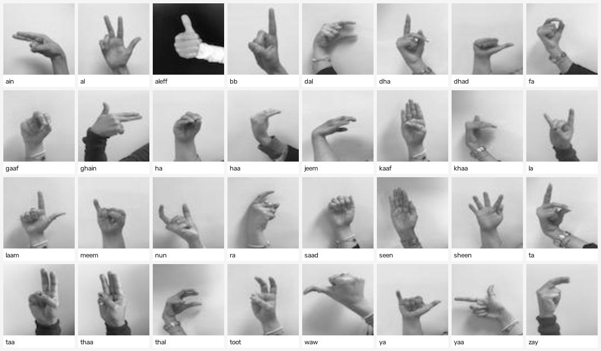
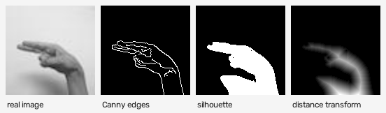

# Structure-Conditioned GANs for Arabic Sign Language Image Generation: From Pixel Loss to Recognition-Optimized Fusion

*Draft — paper-ready scaffold. Fill the `⟨…⟩` placeholders; Model G numbers are
completed by `src/paper_eval.py` after its full run.*

---

## Abstract

We study conditional image generation for the **Arabic Alphabet Sign Language
(ArASL, 54,049 grayscale images, 32 letter classes)** and show that *how a
generator is conditioned and supervised* — not its capacity — determines whether
its samples are recognizable. We build five models on a shared 128×128 backbone.
A label-only cGAN with pixel L1 (**A**) and its MediaPipe-landmark variant (**B**)
plateau near **64–66%** GAN-test recognition because their pixel target is
*unaligned* (regress-to-mean) and MediaPipe barely detects low-resolution
grayscale hands. Conditioning instead on a per-image **structure map** (Canny +
silhouette + distance transform) with an *aligned* target (**C**) raises
recognition to **76.1%**; adding a frozen-landmark consistency loss (**F**) reaches
**87.2%**. Finally, **Model G** augments F with an auxiliary-classifier recognition
loss, a pix2pixHD feature-matching loss, an L1-upgraded landmark term, and
generator weight EMA, reaching **94.6%** — approaching the **97.5%** real-image
classifier ceiling and **increasing** sample diversity. All full runs execute on a
single 8 GB RTX 3050.

## 1. Introduction

- Motivation: data augmentation and educational tools for Arabic sign language;
  recognition-faithful synthesis as the goal.
- Thesis: **conditioning/supervision is the axis that decides everything**;
  network capacity is held fixed across A→B→C→F→G.
- Metric framing: we evaluate with **GAN-test** recognition (train classifier on
  real, test on generated) — a direct measure of class-faithful image quality.
- Contributions:
  1. A controlled ladder (A→B→C→F→G) isolating each supervision signal.
  2. **Model G**, a recognition-optimized fusion cGAN that closes most of the gap
     to the real-image ceiling on 8 GB hardware.
  3. Honest engineering notes: mixed-precision pitfalls, 8 GB memory design,
     and the independence of training vs evaluation classifiers.

## 2. Dataset

ArASL 54K (`pain/ArASL_Database_Grayscale`), 32 Arabic-letter classes, grayscale,
resized to 128×128 and normalized to [−1, 1]. A deterministic 90/10 split (seed 42)
holds out ~5.4K images for evaluation.

*Figure 1. One real image from each of the 32 letter classes.*

## 3. Method

### 3.1 Shared backbone

Class-conditional GAN at 128×128: generator with self-attention (A/B) or a
structure encoder–decoder (C/F/G); spectral-normalized discriminator with spatial
label projection; Adam (β1=0.5, clipnorm 1.0), asymmetric LR (`LR_G=2e-4`,
`LR_D=1e-4`), label smoothing 0.9, 50 epochs, batch 32, mixed precision.

### 3.2 The conditioning/supervision ladder

- **A — label only, pixel L1.** Unaligned target ⇒ regress-to-mean ⇒ low diversity.
- **B — A + MediaPipe landmark MSE.** Detection ≈ 2% on grayscale ⇒ masked out for
  ~98% of samples ⇒ negligible gain.
- **C — structure-conditioned cGAN.** Per-image 3-channel structure map (Fig. 2)
  feeds the generator and a paired discriminator; the L1 target is the *same image*
  the structure came from ⇒ spatial correspondence restored.

*Figure 2. The 3-channel conditioning used by C/F/G, computed with OpenCV.*

- **F — C + landmark fusion.** Adds a frozen-landmark consistency loss on *all*
  samples (no detection gate), the single largest gain in the study.
- **G — recognition-optimized fusion.** Adds (1) an auxiliary-classifier
  recognition loss, (2) discriminator feature-matching, (3) an L1-upgraded
  landmark term, and (4) generator weight EMA. See `model_G.md` for the full
  training graph and the generator-loss equation.

### 3.3 Model G details

*(Insert the Mermaid graph and loss equation from `model_G.md` §3; describe the
independence of the aux classifier from the evaluator, and the 8 GB
outside-the-tape memory design from §4.)*

## 4. Experimental setup

- Hardware: single RTX 3050 (8 GB), WSL2, TensorFlow 2.21, mixed_float16.
- Evaluation (`src/paper_eval.py`): one reference classifier trained on real
  held-out images (accuracy **0.9752**), applied to N=40 generations/class.
  Metrics: **recognition** (GAN-test), intra-class **diversity**, **SSIM** to the
  aligned target, and a **held-out structure** generalization test (C/F/G).
- Per-class **confusion** analysis (`src/confusion_matrix.py`).
- Training wall-clock: A/B/C/F ≈ 3.3 h; **G ≈ 4.3 h** (50 epochs).

## 5. Results

**Table 1.** GAN-test recognition and companions (128px full runs, single
comparable run). Reference classifier on real = 0.9752.

| Model | Recognition ↑ | Diversity ↑ | SSIM ↑ | Held-out recog. | Gen. gap |
|-------|:---:|:---:|:---:|:---:|:---:|
| A | 0.6367 | 0.1779 | — | — | — |
| B | 0.6625 | 0.1926 | — | — | — |
| C | 0.7609 | 0.4136 | 0.7517 | 0.7415 | 0.0194 |
| F | 0.8719 | 0.3722 | 0.8249 | 0.8540 | 0.0179 |
| **G** | **0.9461** | **0.4010** | 0.8251 | 0.9062 | 0.0399 |

- **Fig. 3** — real vs generated per letter (`figures/real_vs_generated.png`):
  A/B blobby, C/F sharper with occasional grid artifacts, **G follows the real
  structure most faithfully.**
- **Fig. 4** — per-model 8×32 generation grids (`figures/samples_{A,B,C,F,G}.png`).
- **Fig. 5** — confusion heatmaps (`results/confusion_*.png`); loss curves (`charts/`).
- Confusion narrative: F's worst classes (`aleff, dha, zay, gaaf, laam`) collapse
  toward `kaaf`; report how G's recognition/feature-matching losses redistribute
  these (fill from `results/confusion_summary.json` after G's run).

## 6. Discussion

- Why structure conditioning + aligned target beats structure-as-loss (A/B).
- Why the landmark MSE in F was under-driven (saturating gradient) and how G's L1
  + higher weight fix it.
- Recognition loss vs diversity trade-off (AC-GAN caveat); role of EMA and
  feature-matching in closing the appearance gap.
- Threats to validity: independent evaluator; single seed; 8 GB constraints.

## 7. Conclusion

Conditioning and supervision — not capacity — drive recognizable ArASL synthesis.
A structure-conditioned cGAN with landmark fusion and a recognition-optimized loss
stack (**Model G**) approaches the real-image classifier ceiling on commodity 8 GB
hardware.

## References (to expand)

- Shmelkov, Schmid, Alahari. *How good is my GAN?* ECCV 2018.
- Odena, Olah, Shlens. *Conditional Image Synthesis with Auxiliary Classifier GANs.* ICML 2017.
- Wang et al. *High-Resolution Image Synthesis with Conditional GANs (pix2pixHD).* CVPR 2018.
- Isola et al. *Image-to-Image Translation with Conditional GANs (pix2pix).* CVPR 2017.
- Yazıcı et al. *The Unusual Effectiveness of Averaging in GAN Training.* ICLR 2019.
- Miyato, Koyama. *cGANs with Projection Discriminator.* ICLR 2018.
- Latif et al. *ArASL: Arabic Alphabets Sign Language Dataset.* Data in Brief 2019.
